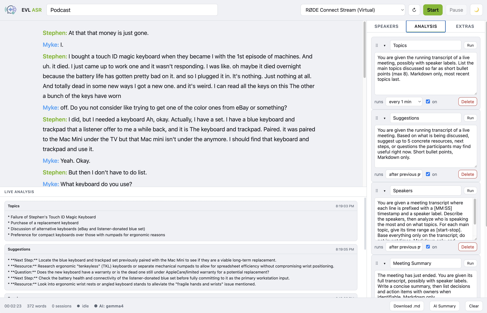

<p align="center"></p>

# EVL ASR — Architecture, Code, and Operations

A developer's guide to the EVL ASR web app: how it's built, how the code is
organized, what the UI does, and how to deploy and configure it. For a quick
user-facing overview see the top-level [`README.md`](../README.md).



---

## 1. What it is

EVL ASR is a minimal web app for **indefinite live speech-to-text**. A browser
captures microphone audio, streams it to a small Python proxy over a WebSocket,
and the proxy relays it to an **NVIDIA ASR NIM** (Riva, OpenAI-Realtime-style
protocol). Transcribed text flows back and grows an append-only transcript that
can run for hours. Optional features layer on top:

- **Speaker diarization** — label who is talking (`Speaker N`, renamable).
- **LLM post-processing** — an on-demand "AI Summary".
- **Background analyzers** — configurable prompts that run on a schedule during
  the meeting (topics, suggestions, speaker analysis, end-of-meeting summary).
- **Markdown export** of the whole meeting.

---

## 2. Architecture

```
 Browser                          Python proxy (server.py)             NVIDIA NIM
┌──────────────────────┐  16 kHz  ┌───────────────────────┐  base64   ┌────────────┐
│ AudioWorklet         │  PCM16    │ Bridge (per session)  │  JSON WS  │ /v1/       │
│  → resample → Int16  │ ───────► │  • audio queue        │ ────────► │ realtime   │
│ WebSocket (same      │ (binary) │  • NIM reconnect      │           │ (Riva ASR) │
│  origin)             │          │  • commit/endpointing │ ◄──────── │            │
│ Append-only          │ ◄─────── │  • diarization        │  deltas / │            │
│  transcript UI       │  JSON     │  • analyzers + LLM    │ completed └────────────┘
└──────────────────────┘  events  └───────────────────────┘
```

The proxy exists so that the browser talks to a **same-origin** socket (no CORS
/ mixed-content), the NIM address and any API key stay **server-side**, raw PCM
is wrapped into the base64 JSON events the NIM expects, and the **upstream NIM
session is transparently reconnected** if it drops — the key to multi-hour use.

### Components

| Component | File | Responsibility |
|---|---|---|
| Proxy / API server | `server.py` | FastAPI app: WebSocket bridge, NIM connection, analyzers, LLM endpoints, static hosting |
| Page + styles | `static/index.html` | Markup and all CSS (inline, theme in CSS variables) |
| Front-end logic | `static/app.js` | Capture, streaming, transcript rendering, panels, exports |
| Audio worklet | `static/pcm-worklet.js` | Resamples mic audio to 16 kHz Int16 PCM on the audio thread |
| Launcher | `GO` | Bash script holding every setting as an env var, then runs uvicorn |
| Local secrets | `GO.local` / `.env` | Git-ignored overrides (API keys, endpoints) |
| Analyzer defaults | `analyzers.json` | Default background-analyzer prompts and schedules |
| Container | `Dockerfile`, `docker-compose.yml`, `docker-entrypoint.sh` | Containerized deployment |
| Reverse proxy | `deploy/nginx-asr.conf` | WebSocket-aware nginx config |

### Segmentation: commit vs. endpointing

The realtime API only emits transcripts when audio is **committed** or
**endpointed** (server-side VAD). The NIM ships with endpointing disabled, so
the proxy supports two modes:

- **Endpointing on** (`ASR_ENDPOINTING=true`) — the NIM finalizes at natural
  pauses. Nicer segmentation, depends on VAD emitting results.
- **Endpointing off** (default) — the proxy commits the buffer every
  `COMMIT_INTERVAL_SEC` seconds. Deterministic; the most reliable mode for a
  VAD-disabled NIM. Pressing **Stop** always flushes the last buffered audio.

### Running indefinitely

- The browser↔proxy socket is kept alive with pings and auto-reconnects if it
  drops while running.
- The proxy↔NIM session auto-reconnects with backoff; a brief gap may drop a
  few audio frames but the accumulated transcript is never lost.
- Audio is buffered in a bounded, **drop-oldest** queue (`AUDIO_QUEUE_MAX`) so
  latency can't grow unbounded during a reconnect.

---

## 3. Backend (`server.py`)

An **async FastAPI** application (uvicorn/ASGI). Settings are read from
environment variables at import time into module-level constants.

### The `Bridge` class

One `Bridge` instance is created per browser WebSocket connection and owns that
session's state and tasks:

- `read_browser()` — drains the browser socket: binary messages are audio
  (enqueued to a bounded `asyncio.Queue`); text messages are JSON control
  messages (`flush`, `stop`, `speaker_names`).
- `run_nim()` — manages the upstream NIM WebSocket: sends the
  `transcription_session.update` config, streams `input_audio_buffer.append`
  events, issues `commit` on a timer (endpointing off), and parses
  `…transcription.delta` (interim) / `…transcription.completed` (final)
  events. Reconnects with backoff.
- `run_analyzers()` — the background-analyzer loop (see below).
- Finalized segments are stored as **structured records**
  `{"t": elapsed_seconds, "speaker": id|None, "text": str}` in
  `transcript_segments`. `_labeled_transcript()` renders them for analyzers as
  `"[MM:SS] <label>: text"`, applying custom speaker names supplied by the
  browser.

Concurrency: `serve()` runs the reader, NIM manager, and analyzer loop as tasks
and tears everything down when any ends.

### Background analyzers

Analyzers are prompt + schedule definitions. Each runs one server-side LLM call
over the current transcript and pushes an `analysis` message to the browser.
Three schedule modes:

| Mode | When it runs |
|---|---|
| `interval` | Every `interval_min` minutes, once the transcript has ≥ `ANALYZER_MIN_CHARS` characters |
| `chain` | Immediately after the previous analyzer in the list ran, receiving that analyzer's output as extra context |
| `on_stop` | Once when the recording is stopped (end of meeting) |

The registry (`_analyzers`) is validated by `_validate_analyzers()` (max 5,
required fields, `chain` can't be first) and loaded from `ANALYZERS_CONFIG`.
Admin edits update it live and are persisted back to the file on a best-effort
basis.

### LLM helper

`llm_chat(system, user)` makes one OpenAI-compatible `chat/completions` call to
`LLM_BASE_URL` with `LLM_MODEL`/`LLM_API_KEY`. Used by the analyzers and by the
`/llm` and `/analyze` endpoints. Returns `{result, model, usage}`.

### HTTP + WebSocket API

| Route | Method | Purpose |
|---|---|---|
| `/` | GET | Serves `index.html`, injecting `window.__BASE__` and prefixing static URLs |
| `/static/*` | GET | Static assets |
| `/config` | GET | Non-secret client config + per-connection ASR **defaults**: `{sample_rate, language, model, llm, llm_model, sessions, diarization, max_speakers, auto_punct, endpointing}` |
| `/ws` | WS | The audio/transcript bridge. Accepts per-connection ASR overrides as query params — `?diarization=&max_speakers=&punct=&endpointing=` — merged over the env defaults by `session_opts()` for that session only |
| `/llm` | POST | Run the transcript through the LLM. Body `{text, analyzer?, instruction?}`; `analyzer` (name or id) uses that analyzer's prompt (drives the AI Summary button → "Meeting Summary") |
| `/analyze` | POST | **Stateless** run of analyzer prompts. Body `{text, analyzers:[{id,name,prompt,mode}]}` → `{results:[{id,name,result|error}]}`. Powers Admin "Run now" / "Run all" so they work outside a live session |
| `/admin/analyzers` | GET/PUT | Read / replace the analyzer registry (`X-Admin-Token` if `ADMIN_TOKEN` set) |
| `/admin/analyzers/reset` | POST | Reload the registry from the on-disk config file (server defaults) |

**WebSocket protocol**

- **Client → server:** binary Int16 PCM frames (audio); JSON `{"type":"flush"}`,
  `{"type":"stop"}`, `{"type":"speaker_names","names":{id:name}}`.
- **Server → client:** `interim` (live hypothesis, replace), `final`
  (`{text, speaker?}`, append), `status` (`{state}`), `analysis`
  (`{id,name,result|error,ts}`), `ai_running` (`{running}` — drives the AI
  activity dot), `session_end`, `error`.

### Sub-path hosting (`BASE_PATH`)

When `BASE_PATH` is set (e.g. `/asr`), the whole FastAPI app is mounted under
that prefix on a parent app, and `/` redirects there. The index route injects
`window.__BASE__` so the client builds correctly prefixed URLs, and rewrites
static asset paths. Empty `BASE_PATH` serves at the root. The reverse proxy must
forward the path unchanged (do not strip the prefix).

### Security: what's exposed to the client

Secrets stay **server-side** by design — the proxy exists precisely so the NIM
address and any API keys never reach the browser. Credentials are only ever used
as outbound bearer headers or for comparison; they are never serialized into any
response.

| Secret | Only used for | Sent to browser? |
|---|---|---|
| `NIM_API_KEY` | `Authorization` header on the server→NIM connection | No |
| `LLM_API_KEY` | `Authorization` header on the server→LLM call | No |
| `ADMIN_TOKEN` | comparing the `X-Admin-Token` header; exposed only as `bool` → `auth_required` | No — only its presence |
| `LLM_BASE_URL` | the server→LLM request URL; exposed only as `bool` → `llm` | No — only its presence |
| `NIM_HOST` / NIM URL | building the NIM WebSocket URL | No — the browser talks to the same-origin `/ws` |

The public `GET /config` returns only non-secret fields the client needs:

```json
{ "sample_rate", "language", "model", "llm": <bool>, "llm_model", "sessions" }
```

**Information disclosure to note:** `/config` is unauthenticated, so any visitor
who can load the page can see the **model names** (`model` = ASR model,
`llm_model` = the analyzer/AI-Summary model), the language, the sample rate, and
the current **session count**. None are credentials — fine for an internal tool
— but if the model name is sensitive, gate `llm_model` behind the admin token or
omit it from `/config`. The `/admin/analyzers` endpoints (which return the
prompt text) are protected by `ADMIN_TOKEN` when it is set.

---

## 4. Front end (`static/`)

Plain ES modules-free JavaScript — no build step, no framework.

### `pcm-worklet.js`

An `AudioWorkletProcessor` running on the audio thread. It resamples the
browser's capture rate to the target `SAMPLE_RATE` and emits Int16 PCM frames to
the main thread, which forwards them over the WebSocket. Running resampling off
the main thread keeps the UI responsive during multi-hour sessions.

### `app.js`

Organized by concern (all sharing a cached `els` map of DOM nodes):

- **Session / capture** — `start()`/`stop()` build the Web Audio graph
  (`getUserMedia` → `MediaStreamSource` → worklet → zero-gain sink), open the
  WebSocket, and manage the elapsed timer. Pause/Resume drops frames and mutes
  the mic track without tearing down the session.
- **WebSocket** — `connectWS()` handles reconnect, and the `onmessage` dispatch
  routes each server message type.
- **Transcript model** — `finalSegments` (`{text, speaker, ms}`) plus a live
  `interimText`. `composeLines()`/`composeText()` group by speaker and apply
  custom names; `renderTranscript()` paints the DOM.
- **Speakers** — a side-panel row per detected speaker; names are stored in
  `speakerNames` and pushed to the server (`sendSpeakerNames()`) so analyzers
  use them too.
- **Exports** — `exportMarkdown()` builds a `.md` document (title + date →
  summary → analyses → transcript); Copy sends plain transcript text.
- **AI / analyzers** — the AI Summary button calls `/llm`; the Admin tab edits
  analyzers and calls `/analyze` for on-demand runs. An AI activity indicator
  (`aiClientCount` + server `ai_running`) turns purple while any AI runs.
- **Admin persistence** — the analyzer set is mirrored to
  `localStorage["asr.analyzers.v1"]` and re-applied to the server on load and
  at startup, so it survives restarts / non-writable config files.

The base URL prefix is read once from `window.__BASE__` into `BASE` and used to
build every same-origin URL (WebSocket, fetches, worklet).

---

## 5. User interface

All in `static/index.html`; a dark theme defined with CSS variables
(`--bg`, `--panel`, `--accent` NVIDIA green, `--ai` purple, …).

- **Header** — title, a **Meeting title** box (added to exports), microphone
  picker + refresh, **Start**, **Pause/Resume** (disabled when idle), and a
  connection status dot.
- **Main column** — a scrolling **transcript** (grey italic = live hypothesis,
  solid = finalized; `Speaker N:` labels when diarization is on) with the
  optional **LLM output** panel (also where the Meeting Summary appears), and a
  fixed-height **Live analysis** panel pinned at the bottom (scrollable) showing
  analyzer result cards.
- **Side panel (tabs)**
  - **Speakers** — one editable row per speaker; typed names replace
    `Speaker N` everywhere.
  - **Analysis** — the analyzer editor. Each row folds (caret), is
    drag-reorderable (handle; order affects `chain` and is persisted on Save),
    and has a **Run** button. Below: **Save**, a blue **Run all now**, and
    **Reset to server defaults**. Optional admin-token field.
  - **Extras** — per-session **transcription settings** (diarization, expected
    speakers, punctuation, and mic processing; saved in `localStorage`, applied
    on Start via `/ws` query params), plus **Download .md**, **Download
    transcript only** (raw timestamped lines), and **Save WAV**. Endpointing has
    no UI toggle — it's governed server-side by `ASR_ENDPOINTING` (kept for a
    future model with VAD support; the current model doesn't endpoint).
- **Footer** — elapsed time, word count, live **session count**, the **AI
  activity** dot (shows the model), and **Download .md** / **AI Summary** /
  **Clear**.

---

## 6. Deploy and configure

### Prerequisites

- A reachable **NVIDIA ASR NIM** (Riva realtime endpoint). For diarization use a
  sortformer model.
- Python 3.12+ (native) or Docker.
- Optional: an **OpenAI-compatible LLM endpoint** (vLLM, Open WebUI, OpenAI, …)
  to enable AI Summary and analyzers.

### A) Native (venv + `GO`)

```sh
python3 -m venv .venv
source .venv/bin/activate          # tcsh: source .venv/bin/activate.csh
pip install -r requirements.txt
./GO                               # then open http://localhost:8080
```

Every setting lives at the top of **`GO`** as an environment variable. Edit them
and re-run. **Do not put real secrets in `GO`** (it's committed) — put them in a
git-ignored **`GO.local`**, which `GO` sources and which overrides the defaults:

```sh
cp GO.local.example GO.local       # then fill in LLM_API_KEY, endpoints, …
```

### B) Docker

Settings are environment variables, so the proxy runs unchanged in a container.
Edit the `environment:` block in `docker-compose.yml`, put secrets in a
git-ignored **`.env`** (auto-loaded via `${VAR}` substitution — see
`.env.example`), then:

```sh
docker compose up -d --build       # open http://localhost:8080
```

### Configuration reference

Full table in the [`README.md`](../README.md#settings-in-go). Key groups:

| Group | Variables |
|---|---|
| NIM upstream | `NIM_SCHEME`, `NIM_HOST`, `NIM_PORT`, `NIM_PATH`, `NIM_INTENT`, `NIM_API_KEY` |
| ASR | `ASR_MODEL`, `ASR_LANGUAGE`, `SAMPLE_RATE`, `AUTO_PUNCT`, `ASR_DIARIZATION`, `ASR_MAX_SPEAKERS` |
| Segmentation | `ASR_ENDPOINTING`, `EOU_*`, `COMMIT_INTERVAL_SEC` |
| Capacity | `MAX_SESSIONS`, `AUDIO_QUEUE_MAX` |
| LLM | `LLM_BASE_URL`, `LLM_MODEL`, `LLM_API_KEY`, `LLM_SYSTEM_PROMPT`, `LLM_TEMPERATURE`, `LLM_MAX_TOKENS`, `LLM_TIMEOUT_SEC` |
| Analyzers | `ANALYZERS_CONFIG`, `ANALYZER_MIN_CHARS`, `ADMIN_TOKEN` |
| Serving | `BASE_PATH`, `SSL_CERT`, `SSL_KEY` (native: `HOST`, `PORT`) |
| Debug | `DEBUG`, `DEBUG_AUDIO_DIR` |

### TLS (mic access off localhost)

Browsers only grant microphone access over `https://` (or `localhost`). Either
set `SSL_CERT`/`SSL_KEY` (passed to uvicorn) or terminate TLS at nginx in front.

### Behind nginx / at a sub-path

`deploy/nginx-asr.conf` shows the WebSocket upgrade headers and long read
timeouts needed for multi-hour streaming. To serve the app under a sub-path, set
`BASE_PATH` (e.g. `/live-asr`) and forward the path **unchanged** (note: no
trailing slash on `proxy_pass`, so the prefix is preserved):

```nginx
location /live-asr/ {
    proxy_pass http://127.0.0.1:8080;   # no trailing slash → keeps /live-asr
    proxy_http_version 1.1;
    proxy_set_header Upgrade    $http_upgrade;
    proxy_set_header Connection $connection_upgrade;
    proxy_set_header Host       $host;
    proxy_read_timeout 3600s;
}
```

### Enabling analyzers / AI Summary

Set `LLM_BASE_URL` (+ `LLM_MODEL`, `LLM_API_KEY`). With no LLM configured the AI
Summary button hides itself and analyzers don't run. Default analyzer prompts
live in `analyzers.json`; edit them there, or live in the **Analysis** tab. If
`ADMIN_TOKEN` is set, the `/admin/analyzers` endpoints require the
`X-Admin-Token` header (entered in the Analysis tab). Because the analyzer set
is also cached per-browser
in `localStorage`, use **Reset to server defaults** to adopt newly shipped
defaults.

### Operational notes

- **Capacity:** `MAX_SESSIONS` caps simultaneous browser sessions; extra
  visitors get a "server at capacity" notice (`0` = unlimited).
- **Secrets:** keep them in `GO.local` / `.env`; both are git-ignored. Rotate
  any key that has been exposed.
- **Debugging:** `DEBUG=true` logs per-frame/per-event detail; `DEBUG_AUDIO_DIR`
  writes the forwarded PCM to a WAV, and the **Save WAV** button downloads
  exactly what the browser captured.
```
